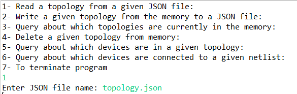
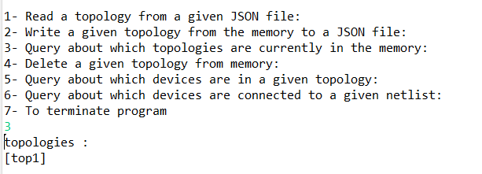
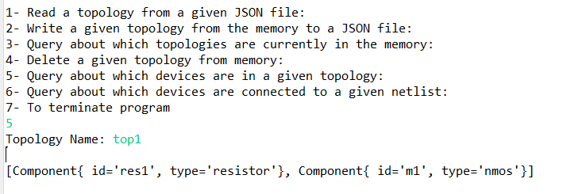
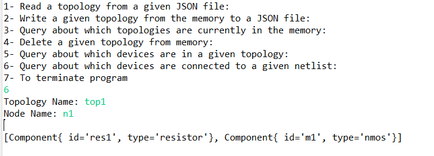
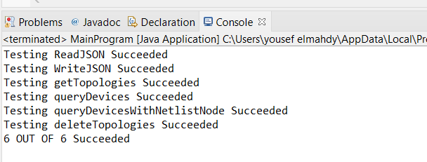

# Topology-API

## 📙About
Program that provide the functionality to access, manage and store device topologies.
## 🏁Getting Started
```
git clone https://github.com/yousefelmahdy/Topology-API.git
```
## 💻Built Using
- Java
## 📷Screenshots
### Read json file

### Get topologies

### devices are in a given topology

### which devices are connected to a given netlist node in a given topology

### Testing

### contributors 
[](https://github.com/yousefelmahdy)
